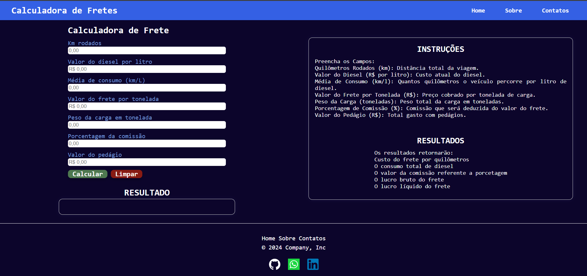
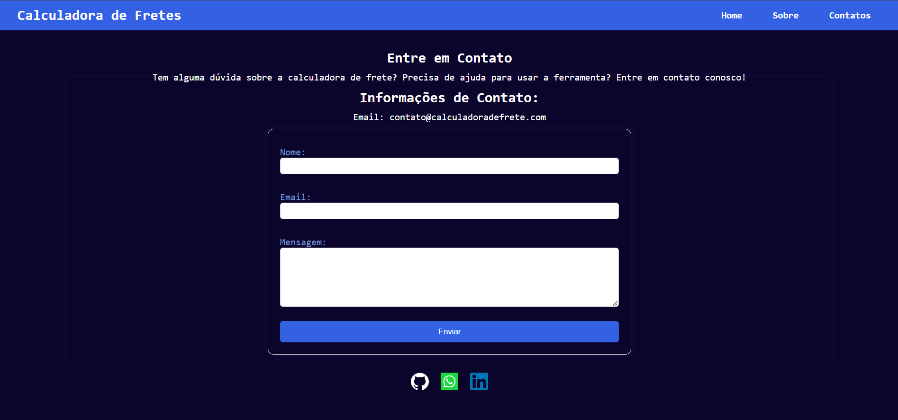
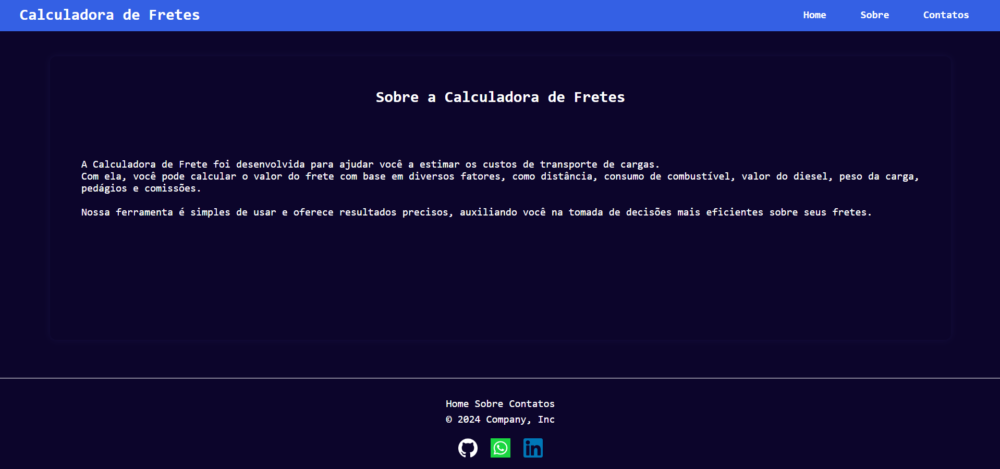

## Este projeto é um implementação de um sistema web feito em mérito de estudo para a conclusão de
semestre do curso de Análise e Desenvolvimento de Sistemas.

Aluno: Mauro Cesar Yaga Junio
Curso:ADS
Faculdade: Senac-PR Maringá
Professor: Rafael Alves Florindo

# Calculadora de Frete

O objetivo deste projeto é desenvolver uma aplicação web que faça cálculos relacionados ao custo de fretes, voltada para caminhoneiros autônomos. A aplicação tem como propósito principal facilitar o cálculo dos custos e ganhos associados às viagens de transporte de cargas, fornecendo uma ferramenta intuitiva e eficiente para auxiliar os profissionais do transporte rodoviário.

Por meio da Calculadora de Frete, os caminhoneiros autônomos poderão inserir  dados relacionados à viagem. Com base nessas informações, a aplicação realizará diversos cálculos automáticos, após deduzir todos os gastos.

### Acesse ao github pages do projeto 

Experimente a calculadora de frete direto no seu navegador: https://mauroyaga.github.io/Calculadora-de-fretes/

### Índice

* [Tecnologias Utilizadas](#tecnologias-utilizadas)
* [Estrutura do Projeto](#estrutura-projeto)
* [Arquivos e Funcionalidades](#arquivos-funcionalidades)
* [Layot das páginas](#telas)
* [Próximos Passos](#proximos-passos)
* [Contribuições](#contribuições)

<h2 id="tecnologias-utilizadas">Tecnologias Utilizadas</h2>

* **HTML:** Estrutura básica da página e dos elementos da interface.
* **CSS:** Estilização da aparência da calculadora, garantindo um design atrativo e responsivo.
* **JavaScript:** Lógica da calculadora, processando os cálculos e atualizando a interface.

<h2 id="estrutura-projeto">Estrutura do Projeto</h2>

* **index.html:** Página principal da calculadora, com o formulário de entrada e a área de resultados.
* **sobre.html:** Página que descreve a calculadora e seu propósito.
* **contatos.html:** Página com informações de contato do desenvolvedor e um formulário para envio de mensagens.
* **styles.css:** Arquivo de estilos CSS responsável pela aparência visual da calculadora.
* **script.js:** Arquivo JavaScript que contém a lógica da calculadora, realizando os cálculos e atualizando a interface.

<h2 id="arquivos-funcionalidades">Arquivos e Funcionalidades</h2>

* **index.html:**
    * **HTML Semântico:** Utilizado para estruturar a página com elementos como `<header>`, `<main>`, `<section>`, `<form>`, `<input>`, `<button>`, `
` e `
`, garantindo acessibilidade e organização do conteúdo.
    * **Formulário de Entrada:** Define os campos de entrada para os dados da calculadora (distância, consumo de combustível, valor do diesel, peso da carga, pedágios e comissões) utilizando o elemento `<form>` com os atributos `id` e `method` para facilitar a interação com o JavaScript.
    * **Área de Resultados:** Cria uma área específica para exibir os resultados dos cálculos, utilizando o elemento `
` com o atributo `id` para facilitar a atualização dinâmica com JavaScript.
    * **Menu Hambúrguer:** Implementa um menu hambúrguer para dispositivos móveis, utilizando CSS para alternar a visibilidade do menu e JavaScript para adicionar interatividade.
* **sobre.html:**
    * **HTML Semântico:** Utiliza elementos HTML semânticos como `<header>`, `<main>`, `<section>` e `
` para organizar o conteúdo e melhorar a acessibilidade da página.
    * **Estilos CSS:** Apresenta um design visual consistente com a calculadora principal, utilizando estilos CSS para a formatação de texto, cores, fontes, espaçamento e layout.
* **contatos.html:**
    * **HTML Semântico:** Emprega elementos semânticos como `<header>`, `<main>`, `<section>`, `<form>`, `<input>`, `<textarea>`, `<button>` e `
` para estruturar o conteúdo e garantir a acessibilidade.
    * **Formulário de Contato:** Cria um formulário para permitir que os usuários enviem mensagens, utilizando o elemento `<form>` com o atributo `id` para facilitar o envio por JavaScript.
    * **Links para Redes Sociais:** Inclui links para as redes sociais do desenvolvedor, utilizando o elemento `<a>` com o atributo `href` para direcionar os usuários para as páginas correspondentes.
* **styles.css:**
    * **Selectors CSS:** Utiliza seletores CSS para aplicar estilos aos elementos HTML, incluindo `id`, `class`, `tag` e `atributos` para selecionar elementos específicos e aplicar estilos a eles.
    * **Propriedades CSS:** Define propriedades CSS como `color`, `font-family`, `background-color`, `padding`, `margin`, `width`, `height`, `display`, `flex-direction`, `align-items`, `justify-content`, `border`, `border-radius`, `box-shadow`, `text-align`, `transform` e `transition` para controlar a aparência e o layout da calculadora.
    * **Responsividade:** Utiliza media queries para ajustar a aparência da calculadora em diferentes tamanhos de tela, garantindo uma experiência de usuário otimizada para dispositivos móveis e desktops.
* **script.js:**
    * **Event Listeners:** Utiliza `addEventListener` para capturar eventos de usuário, como o clique no botão "Calcular" e no botão "Limpar", e executar ações específicas em resposta a esses eventos.
    * **Manipulação do DOM:** Interage com o DOM (Document Object Model) para acessar elementos HTML, modificar seus valores e estilos, e adicionar ou remover conteúdo.
    * **Cálculos de Frete:** Realiza os cálculos do frete, utilizando as informações inseridas no formulário e as operações matemáticas necessárias.
    * **Formatação de Números:** Formata os resultados dos cálculos utilizando a biblioteca `accounting.js` para apresentar os valores de forma clara e legível, com separadores de milhar e casas decimais.
    * **Atualização da Interface:** Atualiza a área de resultados na página principal com os valores calculados, utilizando `innerHTML` para inserir o conteúdo dinamicamente.
    * **Placeholders:** Utiliza placeholders para os campos de entrada, fornecendo dicas visuais para o usuário sobre o tipo de informação que deve ser inserido em cada campo.

<h2 id="telas">Layout das Páginas</h2>

**Página Home**

**Página Contato**

**Página Sobre**

--- 

<h2 id="proximos-passos">Próximos Passos</h2>

* Adicionar funcionalidades para salvar e carregar os resultados da calculadora.
* Integrar APIs de localização para obter as distâncias automaticamente.
* Implementar um sistema de chatbot com IA para dar suporte a informações para o usuário.
* Melhorar o design da calculadora com animações e elementos visuais, como foco em designer de marketing.

<h2 id="contribuições">Contribuições</h2>

Contribuições para este projeto são bem-vindas! Se você tiver alguma sugestão, correção ou melhoria, sinta-se à vontade para abrir um issue ou enviar um pull request.

